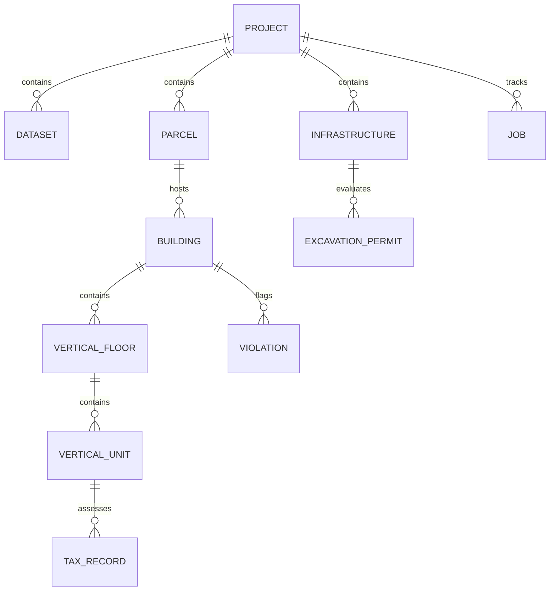

# BHARAT 3D: Database Schema & Entity-Relationship Architecture

## 1. Overview

BHARAT 3D implements a relational geospatial data model designed to support both standard 2D cadastral records (parcels, roads, owners) and vertically stratified 3D real estate (floors, units, subterranean tunnels, elevated flyovers).

---

## 2. Entity-Relationship Diagram (ERD)

---

## 3. Database Table Definitions

### 3.1. `parcels` (2D Cadastral Base Layer)
| Column | Type | Constraints | Description |
| :--- | :--- | :--- | :--- |
| `id` | INTEGER | PRIMARY KEY, AUTOINCREMENT | Internal parcel identifier |
| `ulpin` | VARCHAR(32) | UNIQUE, NOT NULL, INDEX | Unique Land Parcel ID (Bhu-Aadhaar) |
| `project_id` | INTEGER | FOREIGN KEY (`projects.id`) | Associated survey project |
| `ward_number` | VARCHAR(16) | NOT NULL | Municipal administrative ward |
| `area_sqm` | FLOAT | NOT NULL | 2D horizontal plot area ($m^2$) |
| `geometry_geojson` | TEXT | NOT NULL | 2D Polygon in EPSG:4326 GeoJSON |
| `land_use` | VARCHAR(32) | NOT NULL | `RESIDENTIAL`, `COMMERCIAL`, `PUBLIC` |

### 3.2. `buildings` (3D Volumetric Envelopes)
| Column | Type | Constraints | Description |
| :--- | :--- | :--- | :--- |
| `id` | VARCHAR(32) | PRIMARY KEY | Building ID (e.g. `BLD-001`) |
| `parcel_ulpin` | VARCHAR(32) | FOREIGN KEY (`parcels.ulpin`) | Base land parcel ULPIN |
| `name` | VARCHAR(128) | NOT NULL | Building name (e.g. Aarav Heights) |
| `total_floors` | INTEGER | NOT NULL | Total above-ground floors |
| `height_meters` | FLOAT | NOT NULL | Total measured vertical height ($m$) |
| `elevation_base` | FLOAT | NOT NULL | Base elevation in meters MSL |
| `footprint_geojson`| TEXT | NOT NULL | Ground footprint polygon |
| `building_type` | VARCHAR(32) | NOT NULL | `RESIDENTIAL`, `COMMERCIAL`, `MIXED` |

### 3.3. `vertical_floors` (3D Floor Slabs)
| Column | Type | Constraints | Description |
| :--- | :--- | :--- | :--- |
| `id` | VARCHAR(32) | PRIMARY KEY | Floor ID (e.g. `BLD001-F08`) |
| `building_id` | VARCHAR(32) | FOREIGN KEY (`buildings.id`) | Parent building |
| `floor_number` | INTEGER | NOT NULL | Sequential floor index (1 to $N$) |
| `base_elevation`| FLOAT | NOT NULL | Base height above ground ($m$) |
| `top_elevation` | FLOAT | NOT NULL | Top height above ground ($m$) |
| `unit_count` | INTEGER | NOT NULL | Number of subdivided units |

### 3.4. `vertical_units` (3D Property Units - VPRIDs)
| Column | Type | Constraints | Description |
| :--- | :--- | :--- | :--- |
| `vprid` | VARCHAR(64) | PRIMARY KEY, INDEX | Volumetric Property ID (`VPR-BLD001-F08-U04`) |
| `floor_id` | VARCHAR(32) | FOREIGN KEY (`vertical_floors.id`) | Parent floor |
| `unit_number` | VARCHAR(16) | NOT NULL | Flat / suite number (`804`) |
| `carpet_area` | FLOAT | NOT NULL | Internal carpet area ($m^2$) |
| `volume_m3` | FLOAT | NOT NULL | 3D volumetric space ($m^3$) |
| `owner_name` | VARCHAR(128) | NOT NULL | Registered title owner |
| `deed_number` | VARCHAR(64) | NOT NULL | Registered title deed ID |
| `tax_annual` | FLOAT | NOT NULL | Annual municipal property tax ($₹$) |

### 3.5. `infrastructure_assets` (Subsurface Tunnels & Flyovers)
| Column | Type | Constraints | Description |
| :--- | :--- | :--- | :--- |
| `id` | VARCHAR(32) | PRIMARY KEY | Asset ID (e.g. `TNL-002`, `FLY-001`) |
| `name` | VARCHAR(128) | NOT NULL | Infrastructure name |
| `asset_type` | VARCHAR(32) | NOT NULL | `TUNNEL`, `FLYOVER`, `METRO`, `PARKING` |
| `depth_base_msl`| FLOAT | NOT NULL | Z-Elevation in meters MSL |
| `clearance_radius`| FLOAT | NOT NULL | Safety buffer radius ($m$) |
| `geometry_geojson`| TEXT | NOT NULL | 3D centerline / tube geometry |
