# 01. System Overview & Architecture

---

## 🏛️ 1. Executive Summary & Vision

**BHARAT 3D** is a government-grade spatial information platform designed for national urban land governance, volumetric property administration, and infrastructure coordination.

India's existing land governance relies on the **Unique Land Parcel Identification Number (ULPIN)**—a 14-digit alphanumeric identification system based on longitude and latitude coordinates of the parcel's vertices. While ULPIN works exceptionally well for 2D surface land parcels, rapid vertical urbanization creates complex spatial geometries that a 2D bounding polygon cannot represent:
1. High-rise residential towers and condominiums with multiple private owners on identical $X, Y$ coordinates.
2. Mixed-use commercial developments (Malls, Transit-Oriented Developments) with dynamic lease spaces.
3. Subsurface infrastructure networks (Metro tunnels, underground parking, utility conduits) crossing beneath multiple private land parcels.
4. Elevated transportation corridors (Flyovers, elevated expressways, skywalks) occupying air-rights above public roads and private parcels.

### The Guiding Architectural Principle

```text
       ┌────────────────────────────────────────────────────────┐
       │             BHARAT 3D CORE PHILOSOPHY                  │
       │                                                        │
       │   "Keep India's existing 2D cadastral / ULPIN system   │
       │    as the foundation, and add a 3D spatial layer       │
       │    only where property or infrastructure has           │
       │    meaningful vertical extent."                        │
       └────────────────────────────────────────────────────────┘
```

By retaining 2D as the base and generating **Volumetric Property Reference IDs (VPRID)** as volumetric child extensions, BHARAT 3D ensures 100% backward compatibility with state revenue records while enabling modern 3D cadastral administration.

---

## 📐 2. The Multi-Layer Spatial Continuum

BHARAT 3D models the urban environment not as a flat surface, but as a continuous 3D spatial continuum divided into three primary vertical zones:

```text
                                  UPPER / AIR REALM
             ┌────────────────────────────────────────────────────────┐
             │  Air-Rights, Rooftop Helipads, Solar Assets            │
             │  High-Rise Residential / Commercial Volumes (Flats)    │
             │  Elevated Flyovers & Metro Viaducts                    │
             └────────────────────────────────────────────────────────┘

GROUND LEVEL ═════════════════════════════════════════════════════════════════
             │  2D Cadastral Land Parcels (Base ULPIN)                 │
             │  Surface Roads, Footpaths, Rights-of-Way (RoW)         │
             │  Open Spaces, Parks, Water Bodies, Administrative Wards│
             ═════════════════════════════════════════════════════════

                                 SUBSURFACE REALM
             ┌────────────────────────────────────────────────────────┐
             │  Underground Multi-Level Basements & Parking           │
             │  Subsurface Utilities (Power, Telecom, Gas, Water)     │
             │  Deep Underground Metro Tunnels & Underground Drainage │
             └────────────────────────────────────────────────────────┘
```

---

## 🏗️ 3. Complete End-to-End System Architecture

The BHARAT 3D platform follows an enterprise microservices architecture with a decoupled GIS presentation layer, an asynchronous high-throughput processing pipeline, a PostGIS 3D spatial database, and a deterministic governance engine.

```mermaid
flowchart TB
    subgraph DATA_SOURCES["1. Multi-Source Ingestion Layer"]
        D1["Drone Imagery\n(Orthomosaics .TIF)"]
        D2["LiDAR Point Cloud\n(.LAS / .LAZ)"]
        D3["GIS Parcels\n(.GeoJSON / .SHP)"]
        D4["CAD Floor Plans\n(.DXF / .DWG / .IFC)"]
        D5["GNSS / CORS\n(Base / Rover .CSV)"]
        D6["DEM / DSM\n(Elevation .TIF)"]
        D7["Ownership & Tax\n(CSV / JSON / API)"]
    end

    subgraph INGESTION["2. Data Validation & Normalization"]
        V1["File Validation &\nQuarantine Security"]
        V2["Coordinate Transformation\n(PROJ / PyProj to EPSG:4326/3857)"]
        V3["Multi-Modal\nSpatial Fusion"]
    end

    subgraph AI_PIPELINE["3. AI / ML Geometry Extraction"]
        M1["Building Extraction\n(Deep CNN / Mask R-CNN)"]
        M2["Point Cloud Semantic\nClassification (PDAL)"]
        M3["Height Estimation\n(DSM - DTM Analysis)"]
        M4["Floor Inference &\nUnit Segmentation"]
    end

    subgraph TOPOLOGY["4. 3D Cadastre & Topology Engine"]
        T1["Volumetric Extrusion\n(LoD1 to LoD3)"]
        T2["3D Topology Validation\n(No Gaps / Overlaps)"]
        T3["Candidate 3D Model\nGeneration"]
    end

    subgraph REVIEW["5. Human-in-the-Loop Surveyor Studio"]
        R1["MapLibre GL (2D) +\nCesiumJS (3D) Dual Viewer"]
        R2["Interactive 3D Cadastre Editor\n(Add/Split/Edit Floors & Units)"]
        R3["Infrastructure Modeling\n(Tunnels, Flyovers, Cables)"]
        R4["Surveyor Verification &\nDigital Signature"]
    end

    subgraph REGISTRY["6. Spatial Registry & Identity Allocation"]
        ID1["Base 2D ULPIN\n(IN-DL-01-XXXXXXXX)"]
        ID2["Building Identifier\n(BLD-0042)"]
        ID3["Floor & Unit 3D Identifier\n(VPRID: VPR-0042-F08-U804)"]
        ID4["Infrastructure 3D ID\n(INF-TUN-0012)"]
    end

    subgraph GOVERNANCE["7. Government & Municipal Services"]
        G1["Bylaw & Compliance Engine\n(Setbacks, Heights, FAR, G+N)"]
        G2["Encroachment Detection\n(Footpaths, RoW, Open Spaces)"]
        G3["Excavation Risk Safety\n(Subsurface Buffer Clash Detection)"]
        G4["Property Tax &\nOwnership Registry"]
        G5["Citizen Transparency Portal\n(Scoped Access / Privacy)"]
    end

    DATA_SOURCES --> INGESTION
    INGESTION --> AI_PIPELINE
    AI_PIPELINE --> TOPOLOGY
    TOPOLOGY --> REVIEW
    REVIEW --> REGISTRY
    REGISTRY --> GOVERNANCE
```



---

## ⚙️ 4. Multi-Tier Technological Architecture

The platform is structured into five distinct operational tiers:

### Tier 1: Client & Presentation Layer (Frontend)
* **Framework**: React 18 / Next.js 14 with TypeScript.
* **2D Mapping Engine**: **MapLibre GL JS** / OpenLayers for high-performance cadastral vector tiles, parcel boundaries, road networks, and administrative overlays.
* **3D Volumetric Engine**: **CesiumJS** (WebGL / 3D Tiles) for rendering LoD2/LoD3 volumetric buildings, multi-level units, underground tunnels, subsurface utilities, and flyovers.
* **State Management & UI**: Zustand / TanStack Query, TailwindCSS, Shadcn UI, Lucide Icons.

### Tier 2: API Gateway & Application Services
* **API Gateway**: Reverse proxy routing, rate limiting, and SSL/TLS termination.
* **Backend Framework**: Python FastAPI (High-performance Async ASGI) / Node.js Express.
* **Authentication & RBAC**: JWT Bearer Tokens, OAuth2, Role-Based Access Control (5 distinct roles: Surveyor, Municipality, Utility Operator, Citizen, Admin).
* **Real-Time Channel**: WebSockets & Server-Sent Events (SSE) for live streaming the 45-second data processing pipeline.

### Tier 3: Asynchronous Spatial Worker & ML Cluster
* **Message Broker & Task Queue**: Redis + Celery / BullMQ for distributed long-running jobs.
* **Geospatial Processing Stack**:
  * **GDAL / OGR**: Raster and vector format translation, georeferencing, clipping.
  * **PDAL**: LiDAR point cloud filtering, ground classification, noise reduction.
  * **GeoPandas & Shapely**: 2D/3D polygon operations, intersections, spatial joins.
  * **Rasterio & PyProj**: Elevation grid algebra and geodetic coordinate transformations.
* **AI/ML Extraction Pipeline**: PyTorch / TensorRT inference engines for footprint segmentation and height estimation.

### Tier 4: Spatial Database & Storage Layer
* **Primary Relational Database**: **PostgreSQL 16 + PostGIS 3.4**.
  * Native storage for 2D `GEOMETRY(MultiPolygon, 4326)` and 3D `GEOMETRY(PolyhedralSurfaceZ, 4326)` / `GEOMETRY(MultiPolygonZ, 4326)`.
  * Spatial indexing via 3D R-Tree (`GIST (geometry_3d gist_geometry_ops_nd)`).
* **Object Storage Layer**: MinIO / AWS S3 for raw drone orthomosaics, LAS/LAZ point cloud files, CAD drawings, exported 3D Tiles (`b3dm`/`pnts`), and audit snapshots.
* **In-Memory Cache**: Redis 7 for user sessions, active project bounds, and vector tile caching.

### Tier 5: Governance, Rules & Compliance Engine
* **Municipal Bylaws Engine**: Evaluates building geometry against zonal regulations (Front/Rear/Side setbacks, Max Permissible Height, FAR/FSI, Road right-of-way).
* **Subsurface Clash Detection**: 3D spatial buffer calculations identifying utility strikes before excavation permits are approved.
* **Cadastral Snapshot Engine**: Immutable, versioned cadastral snapshots ($V_1, V_2, \dots$) with SHA-256 cryptographic verification and full audit trail logging.

---

## 🔄 5. End-to-End Processing Workflow

```text
[Surveyor Login]
       │
       ▼
[Create Project & Draw Survey Polygon]
       │
       ▼
[Upload Multi-Modal Data] (Drone, LiDAR, GIS, CAD, GNSS, DEM)
       │
       ▼
[45-Second Automated Processing Job (Async SSE Updates)]
       ├─ Phase 1: Security Quarantine & MIME Validation
       ├─ Phase 2: Geodetic CRS Normalization (EPSG:4326)
       ├─ Phase 3: LiDAR Filtering & Ground Extraction (PDAL)
       ├─ Phase 4: Building Footprint AI Extraction
       ├─ Phase 5: DSM-DTM Height Calculation
       ├─ Phase 6: Floor Level & Unit Space Delineation
       └─ Phase 7: 3D Topology & Boundary Integrity Checks
       │
       ▼
[Surveyor 3D Cadastre Review & Verification Studio]
       ├─ Inspect Candidate Geometry
       ├─ Add / Modify / Split Floor Volumes
       ├─ Model Underground Infrastructure (Tunnels, Pipes)
       └─ Digitize Elevated Flyovers & Skywalks
       │
       ▼
[Confirm Cadastre & Allocate VPRIDs]
       │
       ▼
[Published Spatial Registry]
       ├── Municipal Audit: Bylaw Check & Setback Violations
       ├── Utility Operations: Excavation Conflict Analysis
       ├── Revenue Department: 3D Property Tax Assessment
       └── Citizen Portal: Ownership, Tenancy & Title Verification
```

---

## 🏆 6. Key Innovations & Differentiators

| Traditional GIS / 2D Land Records | Commercial 3D City Viewers | BHARAT 3D Cadastral Platform |
| :--- | :--- | :--- |
| Flat 2D land polygons only; fails in high-rise buildings and underground tunnels. | Flashy 3D visual models; disconnected from legal land records and taxation. | **2D-to-3D Linked Cadastre**: Base ULPIN seamlessly extended into volumetric VPRIDs. |
| Manual physical tape measurement for setback violations; slow and subjective. | Visual inspection only; no municipal rule automation. | **Automated Bylaw Engine**: Real-time 3D spatial computation of setbacks, heights, and encroachments. |
| Blind excavation resulting in damaged telecom optical fibers and water pipes. | No subterranean utility integration. | **3D Excavation Risk Analyzer**: Buffer intersection queries flagging subsurface infrastructure clashes. |
| Disconnected ownership and tax spreadsheets. | Superficial 3D building labels. | **Decoupled Identity Model**: Separates Spatial Volume (`VPRID`) from Ownership Title and Rental Leases. |
| Fully manual surveying or opaque black-box AI. | Static 3D mesh representations. | **Human-in-the-Loop Studio**: AI generates candidate volumes; certified surveyors verify and sign. |

---

## 🎯 7. Target Impact for India

1. **Digital India Land Records Modernization Programme (DILRMP)**: Accelerates the transition from 2D parcel digitization to a modern 3D National Spatial Cadastre.
2. **Municipal Revenue Generation**: Prevents property tax leakage by discovering unassessed upper floors ($G+N$) and unauthorized commercial mezzanines.
3. **Ease of Doing Business & Title Guarantee**: Provides unassailable 3D volumetric titles for apartment buyers, banks (collateral verification), and developers.
4. **National Infrastructure Pipeline (NIP)**: Streamlines underground utility coordination, reduces accidental fiber/pipeline cuts, and accelerates metro/tunnel development.
