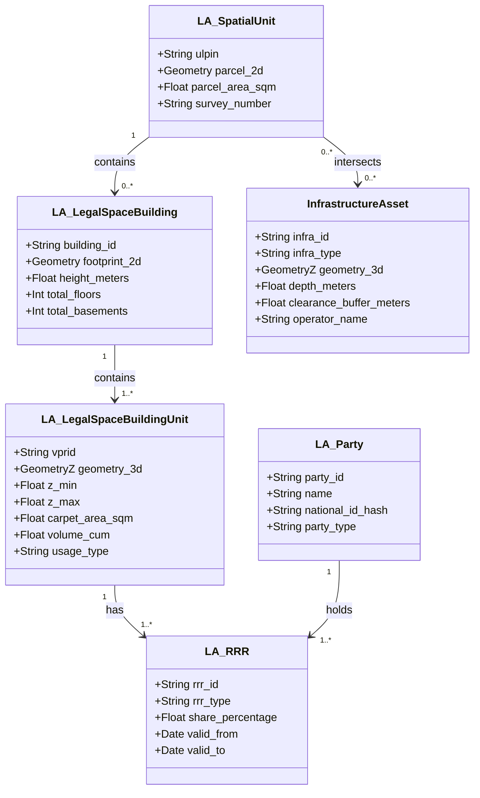

# 02. Data Model & 3D ULPIN (VPRID) Specification

---

## 📐 1. The Tripartite Data Model Philosophy

In conventional municipal records, ownership is frequently conflated with physical property identity. When a property is sold, transferred, or partitioned, databases often overwrite the identity of the physical space, leading to historical data corruption and title ambiguity.

**BHARAT 3D enforces a strict separation between:**
1. **Physical / Spatial Identity (`VPRID`)**: The immutable volumetric space defined by 3D coordinates $(X, Y, Z_{\min}, Z_{\max})$, volume, floor area, and physical boundaries.
2. **Legal Ownership Title (`Ownership`)**: The legal rights holder (Freehold, Joint Ownership, Government, Corporate Entity) with title deed references.
3. **Occupancy & Economic Tenancy (`Occupancy / Lease`)**: The active occupier (Self-occupied, Tenant, Commercial Leasee, Vacant) with validity dates and lease agreements.

```text
                  PHYSICAL / SPATIAL IDENTITY
               (Volumetric Cadastral Parcel)
                            │
               VPRID: VPR-0042-F08-U804
                            │
            ┌───────────────┼───────────────┐
            │               │               │
            ▼               ▼               ▼
    [OWNERSHIP TITLE]   [OCCUPANCY]   [MUNICIPAL TAX]
    Owner: Person A     Type: Lease   Tax ID: TX-804
    Title: DEED-2024    Tenant: Co. B Amount: ₹18,400
    Share: 100%         Term: 2026-28 Status: Paid
```

### Why This Separation Matters in Practice:
* **Stable Cadastral Geometry**: A flat does not change its 3D coordinates or spatial ID when ownership changes hands.
* **Complex Multi-Tenant Commercial Assets**: In a shopping mall or IT park, the building is owned by a single corporate entity, but contains hundreds of distinct commercial lease units with independent utility connections, tax assessments, and tenancies.
* **Temporal Auditability**: Complete historical lineage of previous owners and tenants is maintained without altering the underlying spatial registry.

---

## 🏷️ 2. Standardized 3D Identifier Specification (VPRID)

The **Volumetric Property Reference ID (VPRID)** is designed as an upward-compatible extension to India's national 14-digit **Unique Land Parcel Identification Number (ULPIN)**.

```text
                          VPRID SYNTAX BREAKDOWN
                          
  IN  -  DL  -  01  -  849201  -  B01  -  F08  -  U804  -  R
 ──┬──  ──┬──  ──┬──  ───┬────  ──┬──  ──┬──  ───┬───  ──┬──
   │      │      │       │        │      │       │       │
Country State District Parcel   Building Floor  Unit    Usage
 (ISO)  (Code) (Code)   (ULPIN)   Number Level Number  Type
```

### Identifier Hierarchy & Segments

| Level | Component | Code Format | Description | Example |
| :--- | :--- | :--- | :--- | :--- |
| **Level 0** | **Base 2D ULPIN** | `IN-ST-DST-XXXXXX` | 14-character geocoded national parcel identifier. | `IN-DL-01-849201` |
| **Level 1** | **Building ID** | `B[0-9]{2,3}` | Structural building index situated on the 2D parcel. | `B01` (Tower Alpha) |
| **Level 2** | **Floor Level** | `F[0-9]{2}` / `B[0-9]{2}` | Floor identifier (`F01..F99` above ground; `B01..B05` basement). | `F08` (8th Floor) |
| **Level 3** | **Unit Number** | `U[0-9]{3,4}` | Physical apartment, office, or shop number. | `U804` (Unit 804) |
| **Level 4** | **Usage Classifier** | `[R, C, I, M, U, X]` | Land use code (Residential, Commercial, Industrial, Mixed, Utility, Common). | `R` (Residential) |

### Infrastructure Identifier Standards

For infrastructure assets crossing multiple parcel boundaries or existing entirely subsurface/elevated:

* **Tunnels & Metro Networks**: `INF-TUN-[ZONE]-[NUMBER]` (e.g., `INF-TUN-DL01-0012`)
* **Elevated Flyovers & Skywalks**: `INF-FLY-[ZONE]-[NUMBER]` (e.g., `INF-FLY-DL01-0004`)
* **Subsurface Utilities**: `INF-UTL-[TYPE]-[ZONE]-[ID]` (e.g., `INF-UTL-TEL-DL01-8921` for Telecom Optical Fiber, `INF-UTL-WAT-DL01-3410` for Water Pipeline)
* **Underground Basements / Parking**: `INF-BSM-[ULPIN]-[LEVEL]` (e.g., `INF-BSM-849201-B02`)

---

## 🌐 3. ISO 19152 LADM & OGC CityGML 3.0 Alignment

BHARAT 3D aligns directly with international open spatial standards:
1. **ISO 19152 Land Administration Domain Model (LADM)**:
   * `LA_SpatialUnit`: Base 2D cadastral parcel.
   * `LA_LegalSpaceBuildingUnit`: Volumetric 3D spatial unit representing an apartment, shop, or office.
   * `LA_Party`: Natural persons, corporations, or municipal bodies holding interests.
   * `LA_RRR`: Rights (Freehold, Leasehold), Restrictions (Setbacks, Height limits), Responsibilities (Property Tax, Maintenance).
   * `LA_BAUnit`: Basic Administrative Unit linking spatial units to legal administrative records.
2. **OGC CityGML 3.0 Standard**:
   * Multi-Level of Detail (LoD0: 2D Footprint, LoD1: Extruded Block, LoD2: Standard Roof & Façade, LoD3: Detailed Volumetric Units and Internal Openings).



---

## 🏢 4. Domain Entity Models

### A. Surface Land Parcel (2D Base)
* **ULPIN**: `IN-DL-01-849201`
* **Geometry**: 2D MultiPolygon in EPSG:4326.
* **Attributes**: Survey Number, Ward ID, Municipal Zone, Base Land Area ($m^2$), Permissible FAR ($2.5$), Permissible Max Height ($30.0m$).

### B. High-Rise Apartment Tower
* **Building ID**: `BLD-0042` (Linked to ULPIN: `IN-DL-01-849201`)
* **Vertical Bounds**: $Z_{\min} = 215.0m$ (Ground Elevation MSL), $Z_{\max} = 245.0m$ (Top of Roof).
* **Floor Levels**: Ground + 8 Floors ($G+8$) + 2 Basements ($B1, B2$).
* **Unit Segmentation**:
  * Ground Floor: Common Lobby, Security, 2 Retail Shops.
  * Floors 1 to 8: 4 Residential Flats per floor (e.g., `U101` to `U804`).
  * Unit Attributes: Carpet Area ($115.2 m^2$), Volumetric Extent ($345.6 m^3$), Undivided Land Share (UDS: $4.1\%$).

### C. Commercial Shopping Mall (Lease-Space Paradigm)
* **Building ID**: `BLD-0105` (Grand Central Mall)
* **Ownership**: Single Corporate Entity ("Apex Retail Developers Ltd.").
* **Volumetric Units**: 87 Distinct Commercial Lease Spaces.
* **Unit Attributes**:
  * Unit `S-042`: Anchor Tenant (Hypermarket), Carpet Area: $2,400 m^2$, Lease Status: Active (10-year term).
  * Unit `S-105`: Retail Store, Carpet Area: $85 m^2$, Lease Status: Active (3-year term).
  * Unit `S-210`: Food Court Kiosk, Carpet Area: $25 m^2$, Lease Status: Vacant.
  * Common Spaces: Corridors, Escalator Atriums, Utility Shafts (Non-salable common spatial units).

### D. Subsurface Infrastructure (Metro Tunnel)
* **Asset ID**: `INF-TUN-DL01-0012`
* **Operator**: Delhi Metro Rail Corporation (DMRC).
* **Type**: Underground Twin-Bore Transit Tunnel.
* **Volumetric Geometry**: 3D Polyhedral Cylindrical Sweep ($3.0m$ radius, $1,450m$ centerline length).
* **Depth**: Depth Below Surface = $-14.2m$ to $-18.5m$ ($Z_{\text{centroid}} = 198.5m$ MSL).
* **Legal Status**: Statutory Subsurface Easement Right passing under 18 distinct surface cadastral parcels.
* **Safety Buffer Envelope**: $5.0m$ positional clearance buffer on all sides.

### E. Elevated Transport Corridor (Flyover)
* **Asset ID**: `INF-FLY-DL01-0004`
* **Operator**: Public Works Department (PWD).
* **Type**: 4-Lane Elevated Flyover Deck + Supporting Piers.
* **Volumetric Geometry**: 3D Polyhedral Surface ($16.0m$ deck width, $1.2m$ deck thickness, $780m$ length).
* **Elevation**: Clearance above surface road = $+6.5m$ to $+8.2m$.
* **Air-Rights Status**: Public Right-of-Way air envelope; ground level remains active public roadway.

### F. Subsurface Utility Networks
* **Telecom Fiber**: LineStringZ, Depth: $-1.2m$, Operator: BSNL / National Optical Fiber Network, Safety Buffer: $1.0m$.
* **High-Pressure Gas Pipeline**: LineStringZ, Depth: $-2.2m$, Operator: GAIL / IGL, Safety Buffer: $3.0m$.
* **Potable Water Trunk Main**: LineStringZ, Depth: $-1.8m$, Operator: Jal Board, Safety Buffer: $1.5m$.

---

## 🗄️ 5. PostGIS 3D Geometry Specifications

BHARAT 3D uses standard OGC 3D geometric types within PostGIS to ensure high spatial performance and mathematical rigor:

```sql
-- Volumetric Unit Representation (PolyhedralSurfaceZ)
CREATE TABLE cadastre_volumetric_units (
    vprid VARCHAR(36) PRIMARY KEY,
    ulpin VARCHAR(24) NOT NULL REFERENCES cadastre_parcels(ulpin),
    building_id VARCHAR(24) NOT NULL,
    floor_level INT NOT NULL,
    unit_number VARCHAR(12) NOT NULL,
    usage_type VARCHAR(20) NOT NULL CHECK (usage_type IN ('RESIDENTIAL', 'COMMERCIAL', 'INDUSTRIAL', 'COMMON', 'PARKING')),
    z_min DOUBLE PRECISION NOT NULL,
    z_max DOUBLE PRECISION NOT NULL,
    carpet_area_sqm DOUBLE PRECISION NOT NULL,
    volume_cum DOUBLE PRECISION NOT NULL,
    geometry_3d GEOMETRY(PolyhedralSurfaceZ, 4326) NOT NULL,
    created_at TIMESTAMP WITH TIME ZONE DEFAULT CURRENT_TIMESTAMP,
    updated_at TIMESTAMP WITH TIME ZONE DEFAULT CURRENT_TIMESTAMP
);

-- Subsurface Infrastructure Representation
CREATE TABLE cadastre_infrastructure_assets (
    infra_id VARCHAR(36) PRIMARY KEY,
    infra_type VARCHAR(30) NOT NULL CHECK (infra_type IN ('TUNNEL', 'FLYOVER', 'TELECOM', 'WATER', 'GAS', 'POWER', 'PARKING')),
    operator_name VARCHAR(100) NOT NULL,
    depth_meters DOUBLE PRECISION,
    clearance_buffer_meters DOUBLE PRECISION NOT NULL DEFAULT 1.0,
    geometry_3d GEOMETRY(GeometryZ, 4326) NOT NULL,
    created_at TIMESTAMP WITH TIME ZONE DEFAULT CURRENT_TIMESTAMP
);

-- 3D R-Tree Spatial Indexing for Fast Querying
CREATE INDEX idx_units_geometry_3d ON cadastre_volumetric_units USING GIST (geometry_3d gist_geometry_ops_nd);
CREATE INDEX idx_infra_geometry_3d ON cadastre_infrastructure_assets USING GIST (geometry_3d gist_geometry_ops_nd);
```

---

## 🔍 6. 3D Spatial Integrity Rules

To qualify as a valid cadastral 3D unit, every volume must satisfy strict geometric axioms:
1. **2-Manifold Solid**: The 3D surface mesh must be completely closed, watertight, and oriented with outward-pointing normals ($\oint \mathbf{n} \, dA = 0$).
2. **No Volumetric Overlaps**: $\text{ST\_3DIntersects}(\text{Unit}_A, \text{Unit}_B) = \text{FALSE}$ for any two independent private property units ($\text{Volume}(A \cap B) = 0$).
3. **Vertical Boundary Containment**: A unit's vertical bounds must strictly lie within its parent building envelope ($Z_{\min}^{\text{unit}} \ge Z_{\min}^{\text{bld}}$ and $Z_{\max}^{\text{unit}} \le Z_{\max}^{\text{bld}}$).
4. **Footprint Projection Match**: The 2D footprint projection $\text{ST\_Force2D}(\text{Building})$ must be topologically contained within the underlying 2D parcel boundary unless an approved cantilever or setback easement is registered.
