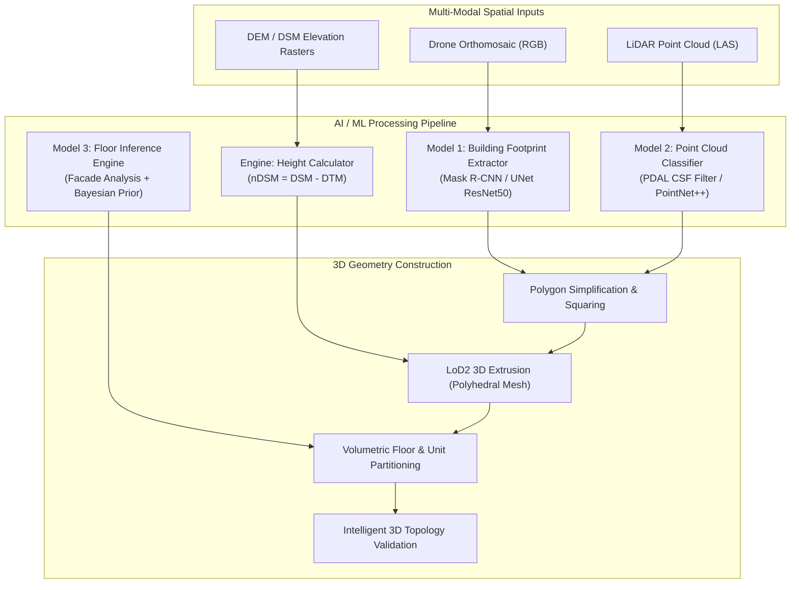

# 04. AI / ML & 3D Geometry Generation Engine

---

## 🧠 1. The Core Engineering Law: AI vs Governance

In public property administration, an AI prediction must never be mistaken for a legal title determination. 

An AI algorithm can detect:
> *"I detected an elevated structure of 27.8 meters with a probability of 9 floors."*

The AI algorithm must **never** make legal claims such as:
> *"Floor 9 is legally owned by Citizen X and is legally authorized."*

```text
    ┌────────────────────────────────────────────────────────┐
    │          SEPARATION OF AI AND GOVERNANCE RULES         │
    │                                                        │
    │   AI / ML PIPELINE       ──▶  Candidate Geometry       │
    │   SURVEYOR VERIFICATION  ──▶  Verified Cadastral Model │
    │   DETERMINISTIC RULES    ──▶  Bylaw & Legal Compliance │
    └────────────────────────────────────────────────────────┘
```

This strict architectural separation guarantees that machine learning provides immense computational acceleration while retaining zero legal liability or black-box errors in state land records.

---

## 🤖 2. Machine Learning Architecture & Models

BHARAT 3D integrates specialized, lightweight AI models into an automated extraction pipeline:



---

## 🔬 3. Detailed AI / ML Pipeline Components

### A. Model 1: Automated Building Extraction
* **Architecture**: Mask R-CNN with Feature Pyramid Network (FPN) and ResNet-50 backbone.
* **Input**: 3-band Orthomosaic RGB ($0.05m$ GSD) + Normalized Digital Surface Model (nDSM) as a 4th band.
* **Output**: Raster building masks with bounding polygon confidence scores ($\text{Confidence} \ge 0.85$).
* **Polygon Regularization**: Raw neural network masks have organic, wavy contours. BHARAT 3D applies the **Douglas-Peucker algorithm** combined with **Minimum Bounding Rectangle (MBR) Orthogonalization** to snap building corners to sharp $90^\circ$ cadastral edges.

### B. Model 2: LiDAR Point Cloud Semantic Classification
* **Toolchain**: PDAL (Point Data Abstraction Library) + Cloth Simulation Filter (CSF).
* **ASPRS Standard Classification**:
  * **Class 2 (Ground)**: Bare-earth terrain model used to generate DTM.
  * **Class 5 (High Vegetation)**: Tree canopies filtered out to avoid false building heights.
  * **Class 6 (Building)**: Roof points and façade returns used for height and ridge extraction.
  * **Class 17 (Infrastructure)**: Bridge decks, flyover spans, and elevated railway viaducts.

### C. Geometric Engine: Height Estimation ($H_{\text{bld}}$)
* **Normalized Surface Calculation**:
  $$\text{nDSM}(x, y) = \text{DSM}(x, y) - \text{DTM}(x, y)$$
* **Building Height Determination**:
  $$H_{\text{bld}} = \text{Percentile}_{95}\Big(\{\text{nDSM}(p) \mid p \in \text{FootprintPolygon}\}\Big)$$
* *Why 95th Percentile?* Filtering out the highest 5% removes anomalies such as rooftop water tanks, mobile towers, and HVAC ducts while preserving true architectural parapet heights.

### D. Model 3: Intelligent Floor Inference Engine
* **Input**: Extracted building height $H_{\text{bld}}$, architectural typology (Residential vs Commercial), and optional CAD floor plans.
* **Typological Height Priors**:
  * Residential Standard: $\mu = 3.05m$ ($\sigma = 0.2m$) per floor.
  * Commercial / Office Standard: $\mu = 3.80m$ ($\sigma = 0.3m$) per floor.
  * Retail / Mall Ground Floor: $\mu = 4.50m$ ($\sigma = 0.5m$).
* **Inference Formula**:
  $$N_{\text{floors}} = \left\lfloor \frac{H_{\text{bld}} - H_{\text{ground\_offset}}}{H_{\text{floor\_prior}}} \right\rceil$$
* **Confidence Calculation**:
  $$\text{Confidence} = 1.0 - \min\left(0.5, \frac{|H_{\text{bld}} - (N_{\text{floors}} \times H_{\text{floor\_prior}})|}{H_{\text{bld}}}\right)$$

---

## 🧱 4. Volumetric Space Generation (LoD1 to LoD3)

Once footprint and vertical floors are calculated, the 3D geometry engine creates watertight volumetric polyhedral solids:

```text
                                 ROOF LEVEL (Z_max)
                        ┌──────────────────────────────┐
                        │      Unit 801  │  Unit 802   │  Floor 8 (Z: 239m - 242m)
                        ├──────────────────────────────┤
                        │      Unit 701  │  Unit 702   │  Floor 7 (Z: 236m - 239m)
                        ├──────────────────────────────┤
                        │            ...               │  ...
                        ├──────────────────────────────┤
                        │      Shop 01   │  Shop 02    │  Ground  (Z: 215m - 219m)
                        └──────────────────────────────┘
                               GROUND LEVEL (Z_min)
                        ════════════════════════════════
                        │   Basement -1 (Parking)      │  B1 (Z: 211m - 215m)
                        └──────────────────────────────┘
```

### Every generated unit volume receives:
* `vprid`: Canonical 3D property identifier.
* `z_min`, `z_max`: Precise ellipsoidal / orthometric vertical extent (meters).
* `carpet_area_sqm`: 2D enclosed floor surface area ($m^2$).
* `volume_cum`: Total 3D volume enclosed by the unit ($m^3$).
* `geometry_3d`: PostGIS `PolyhedralSurfaceZ` representation.

---

## 📐 5. Intelligent 3D Topology Validation Engine

Before presenting candidate models to the surveyor, the geometry engine verifies four strict mathematical rules:

```text
 ┌───────────────────────┬───────────────────────────────────┬─────────────────────┐
 │ TOPOLOGY RULE         │ MATHEMATICAL TEST                 │ VIOLATION RESULT    │
 ├───────────────────────┼───────────────────────────────────┼─────────────────────┤
 │ 1. 2-Manifold Solid   │ Euler: V - E + F = 2 (Genus 0)    │ Broken / Leaky Mesh │
 │ 2. Zero Unit Overlap  │ ST_3DIntersects(Unit_A, Unit_B)=0 │ Double-Sale Risk    │
 │ 3. Envelope Fit       │ Unit_Z ⊆ Building_Z               │ Floating Spatial ID │
 │ 4. Parcel Containment │ ST_Contains(Parcel_2D, Footprint) │ Setback / Breach    │
 └───────────────────────┴───────────────────────────────────┴─────────────────────┘
```

```python
# Conceptual Topology Check in Python (Shapely / Trimesh)
def validate_3d_topology(building_solid, units_list):
    # 1. Check Watertightness
    if not building_solid.is_watertight:
        return {"valid": False, "error": "Building mesh is non-manifold"}
    
    # 2. Check Overlaps between Units
    for i in range(len(units_list)):
        for j in range(i + 1, len(units_list)):
            intersection = units_list[i].intersection(units_list[j])
            if intersection.volume > 0.001:  # Non-zero volumetric overlap
                return {
                    "valid": False,
                    "error": f"Volumetric clash between Unit {i} and Unit {j}"
                }
    return {"valid": True, "error": None}
```
