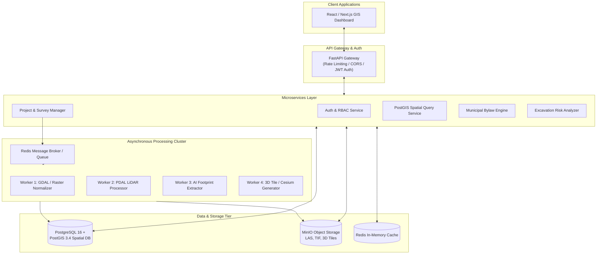

# 05. Backend & Spatial Services Architecture

---

## 🏗️ 1. Backend Service Topology

The BHARAT 3D backend is designed as an asynchronous, event-driven spatial architecture capable of orchestrating multi-sensor data processing, running real-time 3D spatial queries, and managing secure cadastral transactions.



---

## 🗄️ 2. Comprehensive Relational & Spatial Database Schema

The core persistence tier uses **PostgreSQL 16 with PostGIS 3.4** extensions supporting 3D dimensional types (`GeometryZ`, `PolyhedralSurfaceZ`, `TIN`).

```sql
-- 1. Enable PostGIS 3D Extensions
CREATE EXTENSION IF NOT EXISTS postgis;
CREATE EXTENSION IF NOT EXISTS postgis_topology;
CREATE EXTENSION IF NOT EXISTS postgis_raster;
CREATE EXTENSION IF NOT EXISTS "uuid-ossp";

-- 2. User & RBAC Management
CREATE TYPE user_role AS ENUM ('SURVEYOR', 'MUNICIPALITY', 'UTILITY_OPERATOR', 'CITIZEN', 'ADMIN');

CREATE TABLE users (
    user_id UUID PRIMARY KEY DEFAULT uuid_generate_v4(),
    full_name VARCHAR(120) NOT NULL,
    email VARCHAR(120) UNIQUE NOT NULL,
    password_hash VARCHAR(255) NOT NULL,
    role user_role NOT NULL DEFAULT 'CITIZEN',
    department VARCHAR(100),
    mobile_number VARCHAR(15),
    is_active BOOLEAN DEFAULT TRUE,
    created_at TIMESTAMP WITH TIME ZONE DEFAULT CURRENT_TIMESTAMP
);

-- 3. Survey Projects
CREATE TYPE project_status AS ENUM ('DRAFT', 'UPLOADING', 'PROCESSING', 'REVIEW_PENDING', 'CONFIRMED', 'PUBLISHED');

CREATE TABLE survey_projects (
    project_id UUID PRIMARY KEY DEFAULT uuid_generate_v4(),
    project_name VARCHAR(150) NOT NULL,
    ward_number VARCHAR(50) NOT NULL,
    zone_name VARCHAR(100) NOT NULL,
    status project_status DEFAULT 'DRAFT',
    created_by UUID REFERENCES users(user_id),
    survey_polygon GEOMETRY(Polygon, 4326) NOT NULL,
    dataset_version INT DEFAULT 1,
    sha256_digest VARCHAR(64),
    created_at TIMESTAMP WITH TIME ZONE DEFAULT CURRENT_TIMESTAMP,
    updated_at TIMESTAMP WITH TIME ZONE DEFAULT CURRENT_TIMESTAMP
);

-- 4. 2D Cadastral Parcels (Base Layer)
CREATE TABLE cadastre_parcels (
    ulpin VARCHAR(24) PRIMARY KEY, -- e.g. IN-DL-01-849201
    project_id UUID REFERENCES survey_projects(project_id),
    survey_number VARCHAR(50) NOT NULL,
    ward_id VARCHAR(50) NOT NULL,
    parcel_area_sqm DOUBLE PRECISION NOT NULL,
    max_permissible_height DOUBLE PRECISION DEFAULT 30.0,
    permissible_far DOUBLE PRECISION DEFAULT 2.5,
    boundary_2d GEOMETRY(MultiPolygon, 4326) NOT NULL,
    created_at TIMESTAMP WITH TIME ZONE DEFAULT CURRENT_TIMESTAMP
);

-- 5. Buildings
CREATE TABLE cadastre_buildings (
    building_id VARCHAR(36) PRIMARY KEY, -- e.g. BLD-0042
    ulpin VARCHAR(24) NOT NULL REFERENCES cadastre_parcels(ulpin),
    building_name VARCHAR(150),
    total_floors INT NOT NULL DEFAULT 1,
    total_basements INT NOT NULL DEFAULT 0,
    measured_height DOUBLE PRECISION NOT NULL,
    footprint_area_sqm DOUBLE PRECISION NOT NULL,
    footprint_2d GEOMETRY(Polygon, 4326) NOT NULL,
    envelope_3d GEOMETRY(PolyhedralSurfaceZ, 4326),
    created_at TIMESTAMP WITH TIME ZONE DEFAULT CURRENT_TIMESTAMP
);

-- 6. 3D Volumetric Property Units (VPRID)
CREATE TABLE cadastre_volumetric_units (
    vprid VARCHAR(48) PRIMARY KEY, -- e.g. VPR-849201-B01-F08-U804
    building_id VARCHAR(36) NOT NULL REFERENCES cadastre_buildings(building_id),
    ulpin VARCHAR(24) NOT NULL REFERENCES cadastre_parcels(ulpin),
    floor_level INT NOT NULL,
    unit_number VARCHAR(20) NOT NULL,
    usage_type VARCHAR(30) NOT NULL CHECK (usage_type IN ('RESIDENTIAL', 'COMMERCIAL', 'INDUSTRIAL', 'COMMON', 'PARKING')),
    z_min DOUBLE PRECISION NOT NULL,
    z_max DOUBLE PRECISION NOT NULL,
    carpet_area_sqm DOUBLE PRECISION NOT NULL,
    volume_cum DOUBLE PRECISION NOT NULL,
    geometry_3d GEOMETRY(PolyhedralSurfaceZ, 4326) NOT NULL,
    created_at TIMESTAMP WITH TIME ZONE DEFAULT CURRENT_TIMESTAMP
);

-- 7. Infrastructure Assets (Tunnels, Flyovers, Subsurface Utilities)
CREATE TYPE infra_category AS ENUM ('TUNNEL', 'FLYOVER', 'TELECOM', 'WATER', 'GAS', 'POWER', 'PARKING');

CREATE TABLE cadastre_infrastructure_assets (
    infra_id VARCHAR(48) PRIMARY KEY, -- e.g. INF-TUN-DL01-0012
    infra_name VARCHAR(150) NOT NULL,
    infra_type infra_category NOT NULL,
    operator_name VARCHAR(100) NOT NULL,
    depth_meters DOUBLE PRECISION,
    elevation_meters DOUBLE PRECISION,
    clearance_buffer_meters DOUBLE PRECISION DEFAULT 1.5,
    geometry_3d GEOMETRY(GeometryZ, 4326) NOT NULL,
    created_at TIMESTAMP WITH TIME ZONE DEFAULT CURRENT_TIMESTAMP
);

-- 8. Ownership Title Registry (Decoupled Identity)
CREATE TABLE property_ownership (
    ownership_id UUID PRIMARY KEY DEFAULT uuid_generate_v4(),
    vprid VARCHAR(48) NOT NULL REFERENCES cadastre_volumetric_units(vprid),
    owner_name VARCHAR(150) NOT NULL,
    owner_national_id_hash VARCHAR(64),
    title_deed_number VARCHAR(100) NOT NULL,
    registration_date DATE NOT NULL,
    share_percentage DOUBLE PRECISION DEFAULT 100.0,
    is_active BOOLEAN DEFAULT TRUE,
    created_at TIMESTAMP WITH TIME ZONE DEFAULT CURRENT_TIMESTAMP
);

-- 9. Economic Tenancy & Leases
CREATE TABLE property_leases (
    lease_id UUID PRIMARY KEY DEFAULT uuid_generate_v4(),
    vprid VARCHAR(48) NOT NULL REFERENCES cadastre_volumetric_units(vprid),
    tenant_name VARCHAR(150) NOT NULL,
    lease_start_date DATE NOT NULL,
    lease_end_date DATE NOT NULL,
    monthly_rent_inr DOUBLE PRECISION,
    lease_status VARCHAR(20) DEFAULT 'ACTIVE',
    created_at TIMESTAMP WITH TIME ZONE DEFAULT CURRENT_TIMESTAMP
);

-- 10. Municipal Tax Registry
CREATE TABLE property_tax_records (
    tax_id UUID PRIMARY KEY DEFAULT uuid_generate_v4(),
    vprid VARCHAR(48) NOT NULL REFERENCES cadastre_volumetric_units(vprid),
    financial_year VARCHAR(10) NOT NULL,
    assessed_annual_value DOUBLE PRECISION NOT NULL,
    tax_amount_inr DOUBLE PRECISION NOT NULL,
    payment_status VARCHAR(20) DEFAULT 'PAID' CHECK (payment_status IN ('PAID', 'PENDING', 'ARREARS')),
    last_payment_date DATE,
    created_at TIMESTAMP WITH TIME ZONE DEFAULT CURRENT_TIMESTAMP
);

-- 11. Municipal Bylaw Compliance Violations
CREATE TABLE compliance_violations (
    violation_id UUID PRIMARY KEY DEFAULT uuid_generate_v4(),
    building_id VARCHAR(36) NOT NULL REFERENCES cadastre_buildings(building_id),
    violation_type VARCHAR(50) NOT NULL, -- e.g. SETBACK_FRONT, EXTRA_FLOOR, FOOTPATH_ENCROACHMENT
    severity VARCHAR(20) NOT NULL CHECK (severity IN ('LOW', 'MEDIUM', 'HIGH', 'CRITICAL')),
    permissible_value DOUBLE PRECISION NOT NULL,
    observed_value DOUBLE PRECISION NOT NULL,
    violation_magnitude DOUBLE PRECISION NOT NULL,
    geometry_3d GEOMETRY(GeometryZ, 4326),
    status VARCHAR(20) DEFAULT 'OPEN',
    created_at TIMESTAMP WITH TIME ZONE DEFAULT CURRENT_TIMESTAMP
);

-- 12. Non-Repudiation Audit Logs
CREATE TABLE audit_logs (
    log_id UUID PRIMARY KEY DEFAULT uuid_generate_v4(),
    user_id UUID REFERENCES users(user_id),
    action_type VARCHAR(100) NOT NULL,
    entity_id VARCHAR(50) NOT NULL,
    old_value JSONB,
    new_value JSONB,
    sha256_hash VARCHAR(64) NOT NULL,
    timestamp TIMESTAMP WITH TIME ZONE DEFAULT CURRENT_TIMESTAMP
);
```

---

## ⚡ 3. Real PostGIS 3D Spatial Operations (SQL)

### A. Subsurface Excavation Clash Query (3D Buffer Intersection)
When an excavator contractor proposes a trench polygon with depth $D$, find all conflicting subsurface utilities and transport tunnels within their clearance buffer envelope:

```sql
-- Returns all infrastructure conflicting with a proposed 2.0m excavation trench
WITH proposed_excavation AS (
    SELECT ST_SetSRID(
        ST_Extrude(
            ST_GeomFromText('POLYGON((77.2090 28.6139, 77.2095 28.6139, 77.2095 28.6142, 77.2090 28.6142, 77.2090 28.6139))'),
            0, 0, -2.0 -- Extrude downwards 2 meters
        ), 4326
    ) AS excavation_solid
)
SELECT 
    infra.infra_id,
    infra.infra_name,
    infra.infra_type,
    infra.operator_name,
    infra.depth_meters,
    infra.clearance_buffer_meters,
    ST_3DIntersects(
        infra.geometry_3d, 
        pe.excavation_solid
    ) AS direct_strike,
    ST_3DDWithin(
        infra.geometry_3d, 
        pe.excavation_solid, 
        infra.clearance_buffer_meters / 111320.0 -- Degree conversion
    ) AS inside_warning_envelope
FROM 
    cadastre_infrastructure_assets infra,
    proposed_excavation pe
WHERE 
    ST_3DDWithin(infra.geometry_3d, pe.excavation_solid, (infra.clearance_buffer_meters + 1.0) / 111320.0);
```

### B. Front Setback Violation Computation
Determines whether a building footprint crosses the mandatory front setback buffer from the parcel road boundary:

```sql
SELECT 
    b.building_id,
    p.ulpin,
    -- Distance from building front face to parcel front boundary in meters
    ST_Distance(
        ST_Transform(b.footprint_2d, 32643),
        ST_Transform(ST_Boundary(p.boundary_2d), 32643)
    ) AS observed_setback_meters,
    6.0 AS mandatory_setback_meters,
    CASE 
        WHEN ST_Distance(ST_Transform(b.footprint_2d, 32643), ST_Transform(ST_Boundary(p.boundary_2d), 32643)) < 6.0 
        THEN (6.0 - ST_Distance(ST_Transform(b.footprint_2d, 32643), ST_Transform(ST_Boundary(p.boundary_2d), 32643)))
        ELSE 0.0 
    END AS violation_magnitude_meters
FROM 
    cadastre_buildings b
JOIN 
    cadastre_parcels p ON b.ulpin = p.ulpin
WHERE 
    b.building_id = 'BLD-0042';
```

### C. Footpath Encroachment Detection
Calculates the exact polygonal surface area of public footpaths illegally occupied by private building structures:

```sql
SELECT 
    b.building_id,
    p.ulpin,
    ST_Area(
        ST_Transform(
            ST_Intersection(b.footprint_2d, road_footpath.geometry_2d), 
            32643
        )
    ) AS encroached_area_sqm
FROM 
    cadastre_buildings b
JOIN 
    cadastre_parcels p ON b.ulpin = p.ulpin,
    municipal_road_network road_footpath
WHERE 
    road_footpath.layer_type = 'FOOTPATH'
    AND ST_Intersects(b.footprint_2d, road_footpath.geometry_2d);
```
