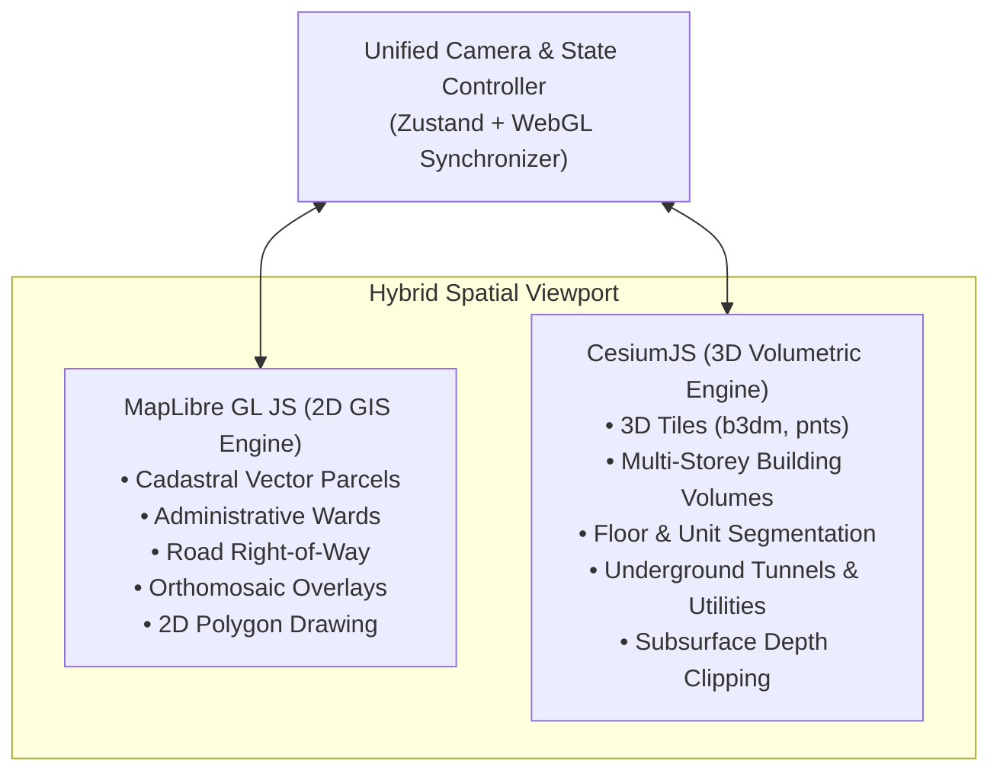

# 06. Frontend & Enterprise GIS UI/UX Architecture

---

## 🎨 1. Enterprise GIS Design Philosophy

The BHARAT 3D user interface is deliberately designed as a **mission-critical government spatial workbench**, not a casual real-estate visualizer or 3D gaming prototype.

```text
       ┌────────────────────────────────────────────────────────┐
       │             ENTERPRISE GIS DESIGN CRITERIA             │
       │                                                        │
       │  • 2D Foundation First: 2D map is clean & responsive   │
       │  • Selective 3D: Volumetric render only where needed   │
       │  • Sub-Second Interactivity: Fast spatial tile picking │
       │  • Precision Editing: Snap-to-vertex cadastral tools   │
       │  • High-Contrast Cartography: Clear legal boundaries   │
       └────────────────────────────────────────────────────────┘
```

---

## 🗺️ 2. Dual-Engine Hybrid Map Architecture

To achieve optimal performance and spatial fidelity, BHARAT 3D integrates two specialized mapping engines in a synchronized hybrid viewport:



### Selective 3D Rendering Principle
* **Surface Roads & Footpaths**: Displayed as crisp, hardware-accelerated 2D vector layers.
* **Empty / Agricultural Parcels**: Rendered as flat 2D cadastral polygons with ULPIN badges.
* **Multi-Storey Buildings**: Rendered as 3D volumetric solids with interactive floor/unit selection.
* **Subsurface Infrastructure**: Displayed in 3D subterranean mode when the underground toggle is activated.
* **Flyovers**: Rendered as elevated 3D deck ribbons hovering above surface roads.

---

## 🛠️ 3. The Surveyor 3D Cadastre Editor Studio

Following automated AI processing, the platform opens the **3D Cadastre Review & Editor Studio**. This human-in-the-loop workspace gives surveyors full authoring control to verify, modify, and certify spatial geometry before official registration.

```text
┌─────────────────────────────────────────────────────────────────────────────┐
│ 🇮🇳 BHARAT 3D  │ Project: Ward 16 Urban Zone │ Mode: Surveyor 3D Studio     │
├────────────────────────────────┬────────────────────────────────────────────┤
│ TOOLBAR                        │ 3D CADASTRE VIEWPORT (CesiumJS)            │
│ [👆 Select] [✏️ Draw Footprint] │                                            │
│ [🏢 Add Floor] [✂️ Split Unit] │     ┌─────────────────────────┐            │
│ [🚇 Add Tunnel] [🌉 Add Flyover]│     │ Floor 8 [Flat 804 (Sel)]│ (Z: 242m)  │
│ [⚡ Add Utility] [📐 Measure]  │     ├─────────────────────────┤            │
│                                │     │ Floor 7 [Flats 701-704] │ (Z: 239m)  │
├────────────────────────────────┤     ├─────────────────────────┤            │
│ LAYER CONTROLS                 │     │ ...                     │            │
│ [x] 2D Cadastral Parcels       │     ├─────────────────────────┤            │
│ [x] AI Building Footprints     │     │ Ground  [Shop 01, 02]   │ (Z: 215m)  │
│ [x] 3D Volumetric Units        │ ════╧═════════════════════════╧══════════  │
│ [ ] Underground Mode (Active)  │     │ Tunnel INF-TUN-012      │ (Z: 198m)  │
├────────────────────────────────┤ ═════════════════════════════════════════  │
│ PROPERTY INSPECTION PANEL      │                                            │
│ VPRID: VPR-849201-B01-F08-U804 │ ACTIONS:                                   │
│ Carpet Area: 115.2 m²          │ [ + Add Floor ] [ ✂️ Split Floor into 4 ]   │
│ Volume: 345.6 m³               │ [ 🗑️ Delete Unit ] [ 💾 Save Geometry ]     │
│ Usage: Residential             │                                            │
│ Classification: Verified       │ [ ✅ CONFIRM & GENERATE 3D IDENTITIES ]    │
└────────────────────────────────┴────────────────────────────────────────────┘
```

### Comprehensive Editor Capabilities

| Entity Type | Available Editing Tools | Operational Workflow |
| :--- | :--- | :--- |
| **Building** | Add, Delete, Translate, Rescale, Modify Footprint, Adjust Height ($Z_{\max}$). | Snaps to parcel boundaries; recalculates gross volume dynamically. |
| **Floors** | Add Floor, Delete Top Floor, Adjust Floor Thickness ($H_f$), Split Floor. | Automatically re-indexes upper floor labels and unit bounds. |
| **Units** | Split Unit (Divide into A, B, C, D), Merge Units, Change Usage Type. | Recalculates carpet area ($m^2$), 3D volume ($m^3$), and Undivided Share (UDS). |
| **Tunnels** | Draw Centerline Alignment, Adjust Depth ($-Z$), Modify Bore Radius ($r$). | Computes subsurface envelope and checks parcel intersections. |
| **Flyovers** | Digitize Elevated Alignment, Set Pier Height ($+Z$), Set Deck Width. | Generates 3D viaduct geometry hovering above surface road. |
| **Utilities** | Draw Cable / Pipeline Vector, Set Trench Depth, Set Safety Buffer ($m$). | Integrates into subsurface risk detection layer. |

---

## 🎛️ 4. Role-Based Specialized Portals

BHARAT 3D provides five purpose-built user interfaces tailored to each stakeholder's official mandate:

```mermaid
graph TD
    LOGIN[Unified SSO / Citizen Login] --> RBAC{Role Check}
    
    RBAC -->|Surveyor| P1[Surveyor Portal\n• Project Creation & Polygon Drawing\n• Multi-Sensor Data Ingestion\n• 45s AI Processing Stream\n• 3D Cadastre Geometry Editor]
    
    RBAC -->|Municipality| P2[Municipal Compliance Portal\n• Zonal Bylaw Audit Engine\n• Setback & Height Violation Highlighter\n• Unauthorized Floor (G+N) Flags\n• Property Tax Roll Reconciliation]
    
    RBAC -->|Utility Operator| P3[Utility & Excavation Portal\n• Subsurface Infrastructure Map\n• Interactive Excavation Polygon Tool\n• 3D Buffer Clash Risk Analysis\n• Dig-Safe Clearance Permit Approval]
    
    RBAC -->|Citizen| P4[Citizen Transparency Portal\n• Privacy-Preserved 'My Properties'\n• 3D Unit Ownership & Tenancy\n• Property Tax Status & Digital Receipt\n• Encumbrance & Title Verification]
    
    RBAC -->|Administrator| P5[Admin Governance Portal\n• User & RBAC Management\n• Dataset Versioning (V1, V2)\n• Cryptographic SHA-256 Audit Trail\n• System Telemetry & Node Health]
```

---

## 🌓 5. Subsurface 3D Visualization Mode

To inspect underground assets without visual occlusion from surface buildings:
1. **Terrain Opacity Slider**: Allows continuous reduction of ground surface opacity ($100\% \to 15\%$).
2. **Subsurface Camera Orbit**: Enables free 3D camera navigation below $Z = 0.0m$ MSL.
3. **Underground Assets Highlight**: Renders metro tunnels in high-contrast cyan, high-pressure gas mains in orange, water pipelines in blue, telecom optical fibers in purple, and multi-level basements in semi-transparent amber.
4. **Depth Indicator Ruler**: Real-time HUD crosshairs showing exact depth below ground level ($\text{meters}$) at cursor location.
