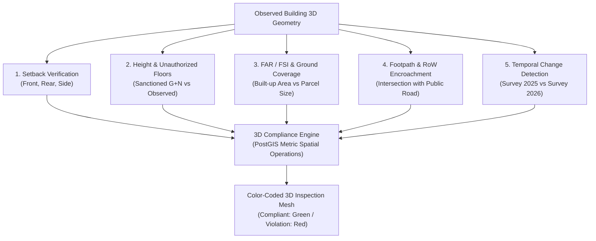

# 08. Municipal Bylaw & Compliance Engine

---

## ⚖️ 1. Automated Municipal Compliance Paradigm

Urban Local Bodies (ULBs) across India face pervasive challenges in enforcing building bylaws. Traditional enforcement relies on manual field inspections with physical measuring tapes, which are labor-intensive, error-prone, subjective, and prone to corruption.

**BHARAT 3D transforms compliance enforcement into a deterministic 3D spatial computation:**

```text
    ┌────────────────────────────────────────────────────────┐
    │              DETERMINISTIC BYLAW WORKFLOW              │
    │                                                        │
    │   Observed 3D Geometry (from LiDAR/Drone)              │
    │                    VS                                  │
    │   Municipal Zonal Bylaws (NBC / Master Plan 2041)      │
    │                    VS                                  │
    │   Sanctioned Building Permission File                  │
    │                    │                                   │
    │                    ▼                                   │
    │   Automated Violation Report & 3D Spatial Highlight    │
    └────────────────────────────────────────────────────────┘
```

---

## 📐 2. Core Compliance Rules & Formulations



---

## 🔬 3. Mathematical & Spatial Formulations

### A. Setback Violation Detection (Front, Rear, Side)
For a building footprint polygon $F$ situated within a cadastral parcel $P$:
* Let $\partial P_{\text{front}}$ be the road-facing front boundary line of the parcel.
* Let $d_{\text{front}} = \min_{p \in F, q \in \partial P_{\text{front}}} \|p - q\|_2$ (Minimum Euclidean distance in metric UTM space).

$$\text{Setback Violation}_{\text{front}} = \max\left(0, S_{\text{mandated}} - d_{\text{front}}\right)$$

* **Example**:
  * Mandated Front Setback ($S_{\text{mandated}}$) = $6.0\text{ meters}$
  * Observed Distance ($d_{\text{front}}$) = $3.8\text{ meters}$
  * **Violation Magnitude** = $2.2\text{ meters}$ (Front façade encroaches into the mandatory setback buffer).

---

### B. Unauthorized Extra Floors ($G+N$) & Height Violation
* Let $H_{\text{sanctioned}}$ be the maximum height approved in the municipal building sanction plan.
* Let $H_{\text{measured}}$ be the 95th-percentile height extracted from the normalized DSM ($\text{DSM} - \text{DTM}$).

$$\Delta H = H_{\text{measured}} - H_{\text{sanctioned}}$$

$$\text{Unauthorized Floors} = \max\left(0, \left\lfloor \frac{\Delta H}{H_{\text{floor\_avg}}} \right\rceil\right)$$

* **Example (Building BLD-0021)**:
  * Sanctioned Plan: $G+4$ ($15.0\text{ meters}$)
  * Measured Height: $G+6$ ($21.2\text{ meters}$)
  * **Outcome**: $2$ unauthorized upper floors detected. The 3D viewer renders Floors 5 and 6 in glowing red with violation notices issued automatically to the municipal dashboard.

---

### C. Floor Area Ratio (FAR / FSI) & Ground Coverage
* **Ground Coverage Ratio**:
  $$\text{Coverage} = \frac{\text{Area}(F_{\text{footprint}})}{\text{Area}(P_{\text{parcel}})} \times 100\% \le \text{Max Permissible Coverage (e.g., } 40\%)$$
* **Floor Area Ratio (FAR)**:
  $$\text{FAR}_{\text{actual}} = \frac{\sum_{i=1}^{N} \text{Area}(\text{Floor}_i)}{\text{Area}(P_{\text{parcel}})}$$
* If $\text{FAR}_{\text{actual}} > \text{FAR}_{\text{permissible}}$, the excess built-up area is computed for compounding penalties or demolition notices.

---

### D. Public Footpath & Road Right-of-Way (RoW) Encroachment
Identifies private structures that illegally breach parcel boundaries into public infrastructure:

$$\text{Encroached Geometry} = F_{\text{footprint}} \cap \text{RoadNetwork}_{\text{footpath}}$$

$$\text{Encroached Area} = \text{ST\_Area}\big(\text{ST\_Transform}(\text{Encroached Geometry}, 32643)\big)$$

* **Result**: When private shops extend permanent staircases, ramps, or shopfronts onto public sidewalks, BHARAT 3D computes the exact area in $m^2$ and pinpoints the violation boundary.

---

## 🛰️ 4. Multi-Temporal Survey Change Detection

Modern urban management is not a one-time static event. BHARAT 3D supports **Temporal Spatial Cadastres** by comparing historical surveys across time epochs ($T_1 \to T_2$):

```text
       SURVEY 2025 (Epoch T1)              SURVEY 2026 (Epoch T2)
      ┌──────────────────────┐            ┌──────────────────────┐
      │                      │            │  FLOOR 6 [NEW/UNAUTH]│ (Z: 236m)
      │  Floor 4             │            ├──────────────────────┤
      ├──────────────────────┤            │  FLOOR 5 [NEW/UNAUTH]│ (Z: 233m)
      │  Floor 3             │            ├──────────────────────┤
      ├──────────────────────┤    ───▶    │  Floor 4             │
      │  ...                 │            │  ...                 │
      ├──────────────────────┤            ├──────────────────────┤
      │  Ground              │            │  Ground              │
      └──────────────────────┘            └──────────────────────┘
      Permitted Height: 15.0m             Detected Height: 21.2m
```

### Change Detection Differential Algorithm:
1. **Volumetric Differential**:
   $$\Delta V = V(T_2) \setminus V(T_1)$$
2. **Classification of Change**:
   * If $\Delta V$ is at upper elevations: **Unauthorized Vertical Expansion**.
   * If $\Delta V$ is at horizontal perimeter: **Unauthorized Lateral Footprint Expansion**.
   * If $\Delta V$ is below ground level: **Unregistered Subsurface Basement Excavation**.

---

## 🏛️ 5. Municipal Action Workflow

```text
[Bylaw Engine Flags Violation]
               │
               ▼
[Municipality Review Dashboard]
       ├── Inspect Color-Coded 3D Violation Mesh
       ├── Download Geocoded Compliance Report (PDF)
       └── Cross-Reference Property Owner & Tax Status
               │
               ▼
[Automated Administrative Action]
       ├── Issue Digital Notice to Property Owner
       ├── Flag Property in Revenue Title Registry (Non-Saleable Encumbrance)
       └── Initiate Compounding Penalty Assessment
```
