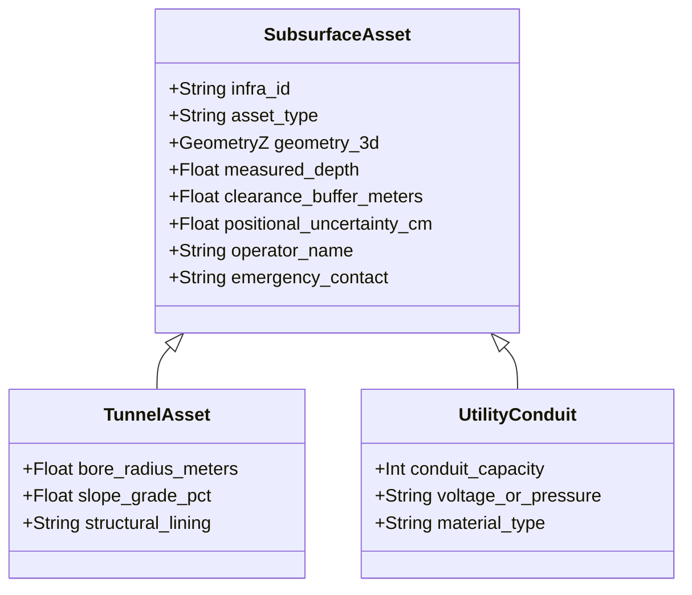
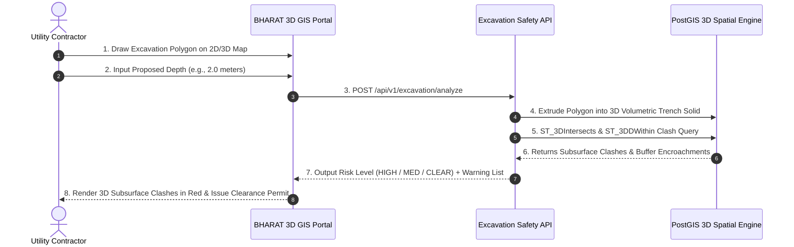

# 09. Subsurface Infrastructure & Excavation Safety Engine

---

## 🚧 1. The Subsurface Crisis in Urban India

Modern Indian cities have crowded subsurface utility networks. Telecom optical fiber cables, high-pressure gas mains, power ducts, water trunk mains, and deep metro rail tunnels all share subterranean space beneath roads and private plots.

### The Cost of "Blind Excavation":
* **Telecom Outages**: Over $70\%$ of fiber cuts in urban corridors occur during uncoordinated road digging by municipal or drainage contractors.
* **Catastrophic Gas & Power Hazards**: Puncturing high-pressure PNG pipelines or striking underground 11kV electrical cables endangers human lives.
* **Metro Structural Risk**: Unauthorized piling or deep basement excavation near metro transit tunnels can induce ground settlement and derailment risks.

```text
GROUND LEVEL ═════════════════════════════════════════════════════════════════
                       Proposed Trench (Depth: 2.0m)
                   ┌──────────────────────────────────┐
                   │    EXCAVATION WARNING ZONE       │
                   └───────┬──────────────────┬───────┘
                           ▼                  ▼
             Telecom Fiber (-1.4m)      Water Pipe (-1.8m)
             [⚠️ DIRECT STRIKE]       [⚠️ BUFFER BREACH]
──────────────────────────────────────────────────────────────────────────────
             High-Pressure Gas Main (-3.2m) [CLEAR]
──────────────────────────────────────────────────────────────────────────────
             Deep Metro Transit Tunnel (-14.2m) [CLEAR]
══════════════════════════════════════════════════════════════════════════════
```

---

## 🗃️ 2. Subsurface 3D Infrastructure Modeling

BHARAT 3D models subsurface assets as true 3D spatial volumes with positional uncertainty envelopes:



### Registered Infrastructure Asset Types

| Asset Category | Representation | Nominal Depth | Safety Buffer | Operator Examples |
| :--- | :--- | :--- | :--- | :--- |
| **Telecom Fiber** | `LineStringZ` | $-1.0m$ to $-1.5m$ | $1.0\text{ meter}$ | BSNL, BharatNet, Telcos |
| **Potable Water Trunk** | `LineStringZ` | $-1.5m$ to $-2.5m$ | $1.5\text{ meters}$ | Jal Board, Municipal Water |
| **Natural Gas Pipeline** | `LineStringZ` | $-2.0m$ to $-3.5m$ | $3.0\text{ meters}$ | IGL, GAIL, City Gas |
| **Underground Power (11kV)**| `LineStringZ` | $-1.2m$ to $-2.0m$ | $2.0\text{ meters}$ | State DISCOMs / Power Grid |
| **Metro Rail Tunnel** | `PolyhedralSurfaceZ`| $-12.0m$ to $-25.0m$| $5.0\text{ meters}$ | DMRC, Maha Metro, CMRL |
| **Basement / Car Park** | `PolyhedralSurfaceZ`| $-3.0m$ to $-12.0m$ | $2.0\text{ meters}$ | Private Developers / ULBs |

---

## ⚡ 3. The Interactive 3D Excavation Risk Analyzer

A utility contractor planning road construction, pipeline laying, or foundation digging uses the **Excavation Risk Portal**:



---

## 🔬 4. Spatial Intersection Algorithm & Risk Scoring

### Step 1: Volumetric Trench Generation
Given a surface polygon $P_{\text{surface}}$ and proposed depth $D$:
$$V_{\text{trench}} = \text{ST\_Extrude}\left(P_{\text{surface}}, 0, 0, -D\right)$$

### Step 2: 3D Spatial Clash Evaluation
For every registered infrastructure asset $I$ with geometry $G_I$ and clearance buffer $B_I$:

1. **Direct Strike Condition**:
   $$\text{ST\_3DIntersects}\left(G_I, V_{\text{trench}}\right) = \text{TRUE}$$
2. **Buffer Envelope Breach Condition**:
   $$\text{ST\_3DDWithin}\left(G_I, V_{\text{trench}}, B_I\right) = \text{TRUE}$$

### Step 3: Composite Risk Score Formula

$$\text{Risk Score} = \sum_{k \in \text{Clashes}} W(\text{AssetType}_k) \times \left(1.0 - \frac{d_k}{B_k}\right)$$

* Where $W(\text{Gas}) = 1.0$, $W(\text{Power}) = 0.9$, $W(\text{Telecom}) = 0.8$, $W(\text{Water}) = 0.7$, and $d_k$ is the clearance distance.
* **Risk Categorization**:
  * $\ge 0.75$: **CRITICAL RISK** $\to$ Digging strictly prohibited without on-site utility officer supervision.
  * $0.40 - 0.74$: **HIGH RISK** $\to$ Manual trial trenching (test-pitting) required.
  * $0.01 - 0.39$: **MEDIUM RISK** $\to$ Caution advised; notify utility operators.
  * $0.00$: **CLEAR** $\to$ Automated digital excavation permit generated.

---

## 🛡️ 5. Operational & Legal Governance Framework

```text
    ┌────────────────────────────────────────────────────────┐
    │              IMPORTANT OPERATIONAL PRINCIPLE           │
    │                                                        │
    │   "AI-assisted excavation risk analysis using          │
    │    registered infrastructure geometry and positional   │
    │    uncertainty."                                       │
    └────────────────────────────────────────────────────────┘
```

### Safety & Liability Boundaries:
* The system does **not** claim to replace on-ground manual test-pitting; rather, it replaces completely blind uncoordinated digging.
* Every excavation analysis generates a **Digitally Signed Clearance Log** recording the contractor's identity, timestamp, proposed depth, and detected risk level.
* Utility operators receive automatic SMS and webhook alerts whenever a high-risk excavation permit is requested within their utility corridor.
