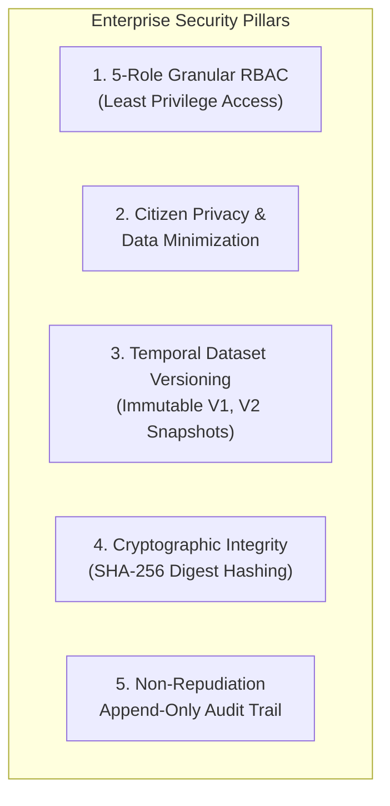

# 10. Security, RBAC & Enterprise Governance

---

## 🔒 1. Sovereign Security Architecture

Land ownership and subterranean critical infrastructure are national security assets. BHARAT 3D is architected around **Zero-Trust Security, Strict Role-Based Access Control (RBAC), and Cryptographic Non-Repudiation**.



---

## 👥 2. 5-Role Granular Access Control Matrix (RBAC)

| Resource / Action | 👷 Surveyor | 🏛️ Municipality | ⚡ Utility Operator | 👤 Citizen | 🛡️ Admin |
| :--- | :---: | :---: | :---: | :---: | :---: |
| **Create Survey Project** | ✅ Yes | ❌ No | ❌ No | ❌ No | ✅ Yes |
| **Upload Raw Drone / LiDAR** | ✅ Yes | ❌ No | ❌ No | ❌ No | ✅ Yes |
| **Run 3D AI Pipeline** | ✅ Yes | ❌ No | ❌ No | ❌ No | ✅ Yes |
| **Edit 3D Cadastre Geometry**| ✅ Yes | ❌ No | ❌ No | ❌ No | ❌ No |
| **Confirm / Publish Dataset**| ✅ Yes | ❌ No | ❌ No | ❌ No | ✅ Yes |
| **Run Bylaw Compliance** | 👁️ View | ✅ Full Audit | ❌ No | ❌ No | ✅ Full |
| **Issue Demolition / Notice**| ❌ No | ✅ Yes | ❌ No | ❌ No | ❌ No |
| **Subsurface Asset View** | 👁️ Read | 👁️ Read | ✅ Full Query | ❌ No | ✅ Full |
| **Run Excavation Risk Tool** | ❌ No | 👁️ View | ✅ Full Query | ❌ No | ✅ Full |
| **Issue Dig Clearance** | ❌ No | ❌ No | ✅ Yes | ❌ No | ✅ Yes |
| **View All Citizen Ownership**| ❌ No | ✅ Full Roll | ❌ Masked | ❌ No | ✅ Audit |
| **View 'My Properties'** | ❌ Own Only | ❌ Own Only | ❌ Own Only | ✅ Scoped Only| ✅ Admin |
| **Audit Logs & Versioning** | 👁️ Own Logs | 👁️ Own Logs | 👁️ Own Logs | ❌ No | ✅ Full Trail |

---

## 👤 3. Citizen Privacy & Data Minimization

In compliance with India's **Digital Personal Data Protection (DPDP) Act**:

```text
    ┌────────────────────────────────────────────────────────┐
    │              CITIZEN PRIVACY SAFEGUARDS                │
    │                                                        │
    │  • Scoped Access: Citizens can only query properties   │
    │    cryptographically bound to their verified identity. │
    │  • No Open Browsing: Citizens cannot look up neighbors│
    │    or browse private wealth/tax assessments.           │
    │  • Identity Masking: National IDs (Aadhaar / PAN) are │
    │    never stored in plaintext (Salted SHA-256 Hashes).  │
    │  • Cross-Domain Wall: Utility contractors cannot see   │
    │    private ownership, tenancy, or financial data.      │
    └────────────────────────────────────────────────────────┘
```

---

## 🕰️ 4. Cadastral Versioning & Temporal Snapshots

Cadastral property records must never be destructively overwritten. Corrections, resumptions, or multi-year resurveys generate immutable **Temporal Cadastral Versions**:

```text
Project: Urban Zone 01 (Ward 16)
   │
   ├── [Dataset Version 1] (Surveyed: Jan 2025)
   │      ├─ SHA-256: 4f89b...
   │      └─ Status: Historical Archive
   │
   ├── [Dataset Version 2] (Surveyed: Feb 2026)
   │      ├─ SHA-256: e3b0c...
   │      └─ Status: Active Official Cadastre
   │
   └── [Dataset Version 3] (Draft in Review)
          └─ Status: Surveyor Work-in-Progress
```

### Digital Dataset Certification:
When a surveyor finalizes a dataset, the system compiles all parcel boundaries, building envelopes, volumetric unit solids, and infrastructure assets into a canonical GeoJSON/JSON payload and computes its **SHA-256 cryptographic digest**:

$$\text{Digest} = \text{SHA256}\Big(\text{Canonical}(\text{Parcels} \cup \text{Buildings} \cup \text{Units} \cup \text{Infrastructure})\Big)$$

This digest is stored in the `survey_projects` table and serves as an untamperable digital stamp for state land registries.

---

## 📝 5. Non-Repudiation Immutable Audit Trail

Every state-changing transaction (geometry modification, depth change, bylaw clearance, lease registration) writes an unalterable log record:

```json
{
  "log_id": "89ab1024-bc71-4190-8412-1920ef0021ba",
  "timestamp": "2026-09-09T10:32:15.892Z",
  "user_id": "9b1deb4d-3b7d-4bad-9bdd-2b0d7b3dcb6d",
  "user_name": "Rajesh Kumar (Surveyor ID: SRV-104)",
  "ip_address": "10.42.18.91",
  "action": "MODIFY_INFRASTRUCTURE_DEPTH",
  "entity_id": "INF-TUN-DL01-0012",
  "change_diff": {
    "field": "depth_meters",
    "old_value": 12.5,
    "new_value": 14.2
  },
  "rationale": "Corrected based on DMRC structural alignment drawing Rev 4",
  "sha256_record_hash": "a591a6d40bf420404a011733cfb7b190d62c65bf0bcda32b57b277d9ad9f146e"
}
```
